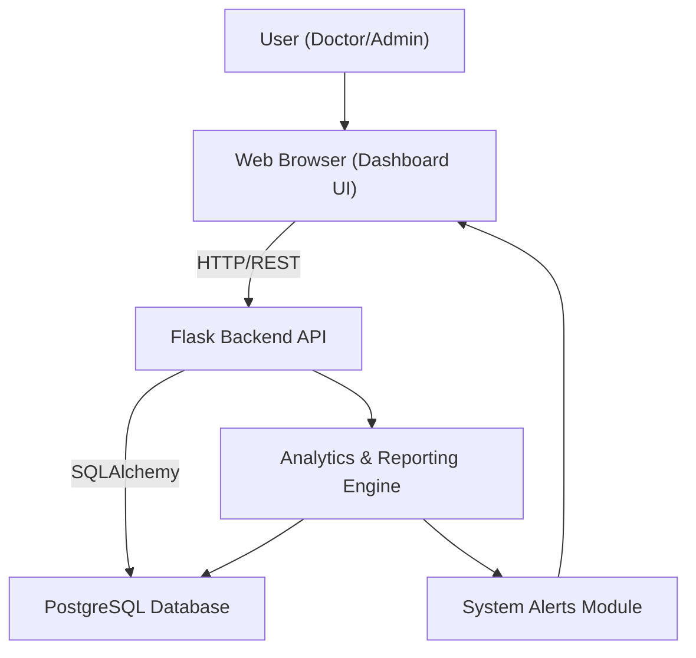
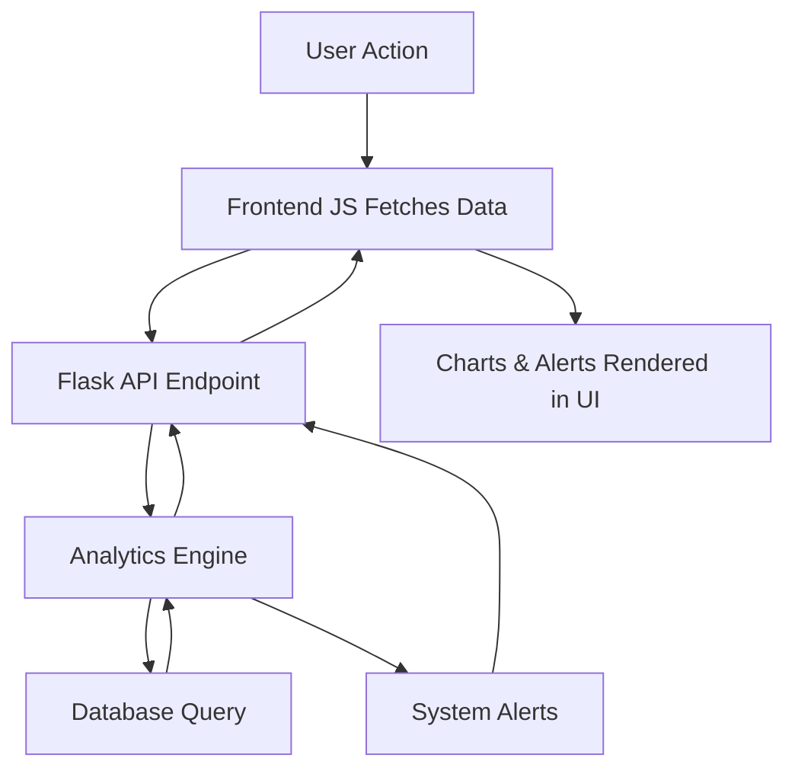
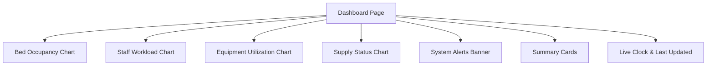

# Healthcare Resource Dashboard

A modern web-based dashboard for real-time monitoring and management of healthcare facility resources. Track bed occupancy, staff workload, equipment utilization, and supply status across departments with interactive analytics and beautiful visualizations.

---

## 🌟 Features

- **Bed Occupancy Tracking:** Stacked bar chart for occupied vs available beds by department.
- **Staff Workload Trends:** Line chart for staff hours over the last 7 days.
- **Equipment Utilization:** Doughnut chart and progress bars for equipment usage.
- **Supply Chain Management:** Bar chart for supply transactions and low stock alerts.
- **Summary Cards:** Quick stats for beds, staff, equipment, and supplies.
- **Animated System Alerts:** Dismissible, color-coded banners for critical/warning events.
- **Live Clock & Last Updated:** Real-time clock and last data refresh time at the top.
- **System Alerts Banner:** Always visible for immediate attention.
- **(Planned) Department Filter:** Filter all charts by department.

---

## 🛠 Technology Stack

**Frontend:**
- HTML5, TailwindCSS, Chart.js, JavaScript (ES6+)

**Backend:**
- Python 3.9+, Flask, SQLAlchemy, PostgreSQL

**Other:**
- Docker (optional), dotenv, pandas

---

## 📋 Prerequisites
- Python 3.9 or higher
- PostgreSQL 12 or higher
- (Optional) Docker

---

## 🚀 Quick Start

```bash
# Clone the repository
$ git clone <your-repo-url>
$ cd Healthcare\ Resource\ Optimisation

# Create and activate a virtual environment
$ python -m venv venv
$ source venv/bin/activate

# Install dependencies
$ pip install -r requirements.txt

# Set up environment variables (.env file)
DB_USERNAME=your_username
DB_PASSWORD=your_password
DB_HOST=localhost
DB_PORT=5432
DB_NAME=healthcare_db

# Initialize the database
$ python setup.py

# Generate sample data
$ python sample_data_generator.py

# Run the dashboard
$ cd healthcare_dashboard
$ python run.py
```

Open your browser to [http://localhost:5000](http://localhost:5000)

---

## 📊 Screenshots

> **Add your dashboard screenshots here!**


---

## 🖼️ System Architecture Diagram



---

## 🔄 Data Flow Diagram



---

## 🧩 Dashboard Component Diagram



---

## ✨ Cool Features & Ideas

- **Animated System Alerts:** Show banners for critical/warning events (e.g., "ICU at 95% capacity!").
- **Live Clock & Last Updated:** Show real-time clock and last data refresh time.
- **Mini Heatmap/Calendar:** (Planned) Visualize bed occupancy over the last 30 days.
- **Department Filter:** (Planned) Filter all charts by department for focused analysis.
- **Drill-down:** (Planned) Click on a chart segment to see detailed records.
- **Export Reports:** (Planned) Download PDF/Excel reports of dashboard data.

---

## 📈 API Endpoints
- `GET /api/data`: Fetch all dashboard data
- `GET /api/departments/status`: Get current department status
- `GET /api/dashboard/summary`: Get summary statistics

---

## 🧪 Testing & Logging
- Equipment, patient, supply, and staff management tests
- Detailed logging for database operations and errors

---

## 🤝 Contributing
1. Fork the repository
2. Create your feature branch (`git checkout -b feature/AmazingFeature`)
3. Commit your changes (`git commit -m 'Add some AmazingFeature'`)
4. Push to the branch (`git push origin feature/AmazingFeature`)
5. Open a Pull Request

---

## 📄 License
MIT License

---

## 👥 Authors
- Bhuvan Shah - Initial work

---

## 🙏 Acknowledgments
- Chart.js for visualization
- TailwindCSS for styling
- Flask & SQLAlchemy for backend
